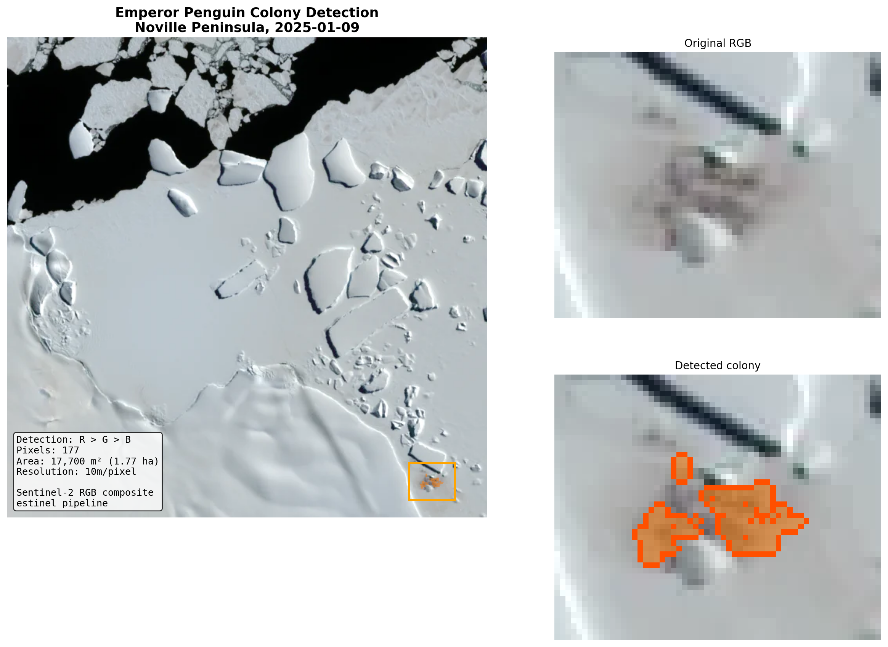
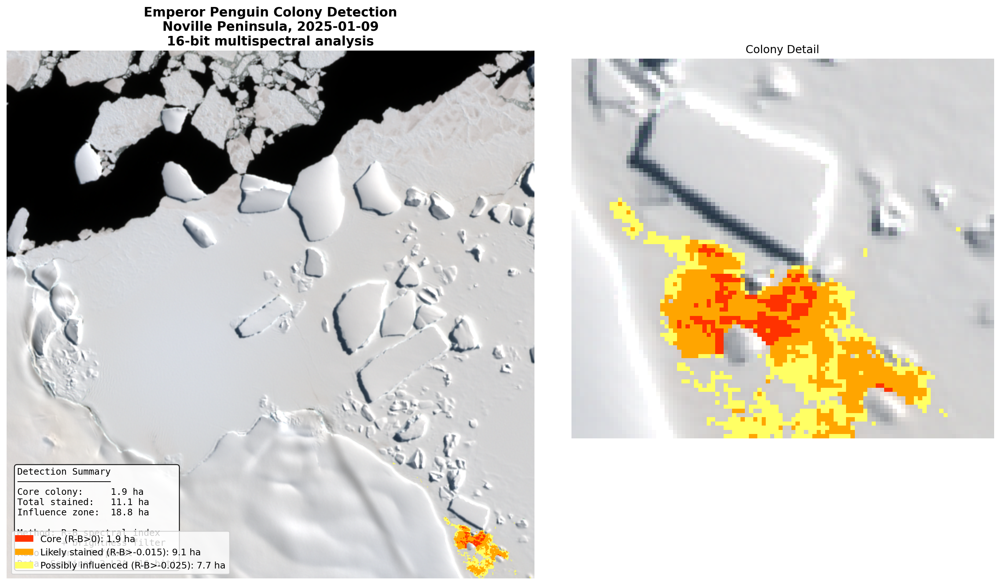
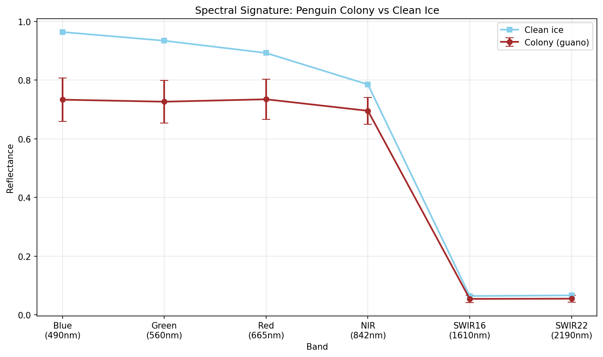
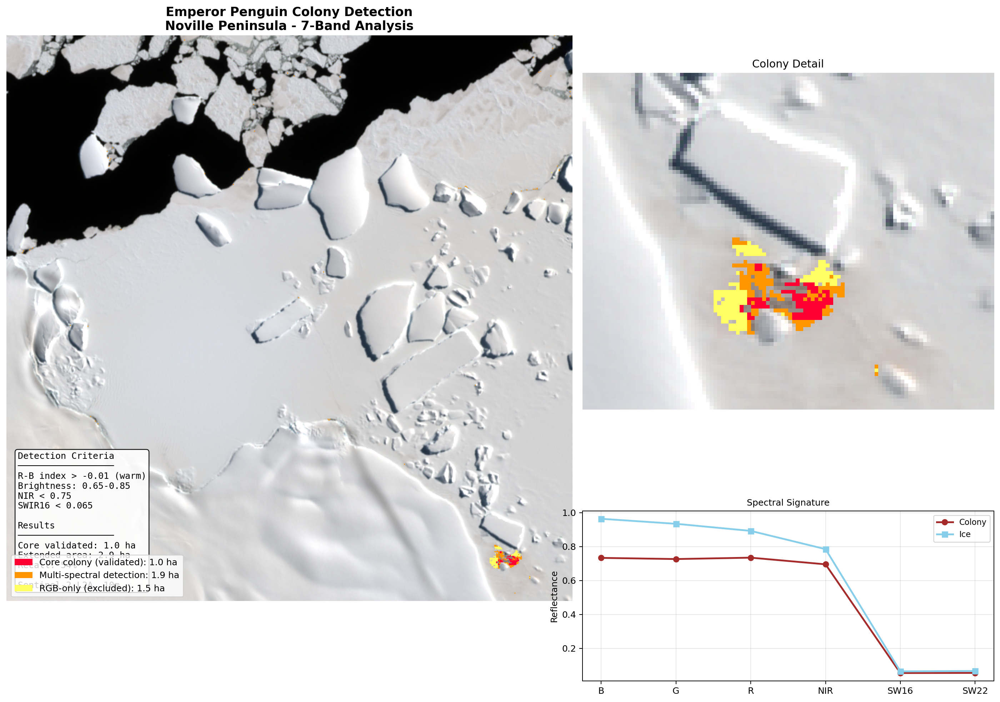

# Emperor Penguin Colony Detection from Sentinel-2 Imagery

## Noville Peninsula Case Study - January 2025

---

## Overview

This document summarises an exploratory analysis to detect emperor penguin colonies from Sentinel-2 satellite imagery using spectral indices. Starting from a compressed RGB PNG, we progressively refined detection methods using 16-bit data and full 7-band multispectral imagery.

**Key finding:** Penguin colonies (guano staining) have a distinctive *flat* visible spectrum (R ≈ G ≈ B) compared to clean ice which slopes downward (B > G > R). This difference is captured effectively by a simple **R-B spectral index**.

---

## Data

| Source | Format | Bands | Resolution |
|--------|--------|-------|------------|
| Sentinel-2 L2A | GeoTIFF | RGB, NIR, SWIR16, SWIR22, SCL | 10m |
| Location | Noville Peninsula, Antarctica | | |
| Date | 2025-01-09 | | |

---

## Method Evolution

### Stage 1: 8-bit RGB PNG

Initial detection using simple band ordering rule:

```
colony_mask = (R > G) & (G > B) & (R > 100) & (R < 250)
```

**Result:** 177 pixels = **1.77 ha** detected in bottom-right region



**Lesson learned:** The naive R-B index initially found false positives in shadowed areas (bottom-left). Shadows appear "warm" because blue skylight fills them less than direct illumination. The key distinction is *absolute* brown (R > G > B) vs *relative* warmth.

---

### Stage 2: 16-bit GeoTIFF

Full dynamic range (~14,000 levels vs 255) revealed:

- Colony region R-B anomaly: **+0.004** relative to ice baseline
- The 8-bit detection was capturing real signal, not compression noise
- Nested confidence zones possible with finer thresholds

| Confidence | Threshold | Area |
|------------|-----------|------|
| Core | R-B > 0 | 1.9 ha |
| Likely stained | R-B > -0.015 | 11.1 ha |
| Influence zone | R-B > -0.025 | 18.8 ha |



---

### Stage 3: 7-Band Multispectral

Added NIR (842nm), SWIR16 (1610nm), SWIR22 (2190nm) for full spectral analysis.

#### Spectral Signature Comparison



| Band | Colony | Ice | Difference |
|------|--------|-----|------------|
| Blue (490nm) | 0.73 | 0.96 | -0.23 |
| Green (560nm) | 0.73 | 0.93 | -0.21 |
| Red (665nm) | 0.73 | 0.89 | -0.16 |
| NIR (842nm) | 0.70 | 0.78 | -0.09 |
| SWIR16 (1610nm) | 0.054 | 0.064 | -0.010 |
| SWIR22 (2190nm) | 0.055 | 0.067 | -0.011 |

**Key observation:** Colony has ~20% lower reflectance across all visible bands, but crucially maintains a *flat* spectral profile. Ice shows characteristic blue-dominated slope.

#### Discriminating Indices

| Index | Colony | Ice | Δ |
|-------|--------|-----|---|
| **R-B** | +0.001 | -0.039 | **+0.040** |
| NIR-R (NDVI) | -0.026 | -0.064 | +0.038 |
| NIR-SWIR | 0.856 | 0.849 | +0.007 |

The **R-B index provides the strongest discrimination** (+0.040 difference), confirming that RGB-only detection is spectrally sound.

---

## Final Detection Algorithm

### Multi-spectral criteria:

```python
colony_mask = (
    (rb_index > -0.01) &      # flat/warm spectrum
    (brightness > 0.65) &      # not shadow
    (brightness < 0.85) &      # not bright ice
    (NIR < 0.75) &             # darker in NIR
    (SWIR16 < 0.065)           # SWIR absorbing
)
```

### Performance comparison:

| Method | Detection | Precision | Recall |
|--------|-----------|-----------|--------|
| RGB-only | 4.3 ha | 31% | 76% |
| Multi-spectral | 2.9 ha | 33% | 54% |



---

## Practical Recommendations

1. **For scanning/discovery:** Use RGB-only R-B index (high recall)
   ```
   candidates = (rb_index > -0.015) & (brightness > 0.6) & (brightness < 0.9)
   ```

2. **For validation:** Apply multi-spectral criteria (higher precision)

3. **For quantification:** Use nested confidence zones
   - Core (R-B > 0): definite guano
   - Extended (R-B > -0.015): likely stained
   - Influence (R-B > -0.025): possibly affected

4. **Change detection:** Track area in each zone over time series

---

## Files

| Filename | Description |
|----------|-------------|
| `colony_map.png` | 8-bit RGB detection map |
| `colony_final_16bit.png` | 16-bit nested confidence zones |
| `spectral_signature.png` | Colony vs ice spectral profiles |
| `spectral_overview.png` | All 7 bands and derived indices |
| `detection_comparison.png` | RGB vs SWIR vs combined methods |
| `colony_7band_final.png` | Final multi-spectral detection |

---

## Next Steps

- Apply to additional known colony sites for threshold calibration
- Build training dataset with human-labeled regions
- Test against commercial high-resolution imagery
- Integrate Sentinel-1 SAR for cloud-free / polar night coverage
- Automate time series analysis for seasonal monitoring

---

*Analysis conducted using Sentinel-2 L2A data via the estinel pipeline.*
